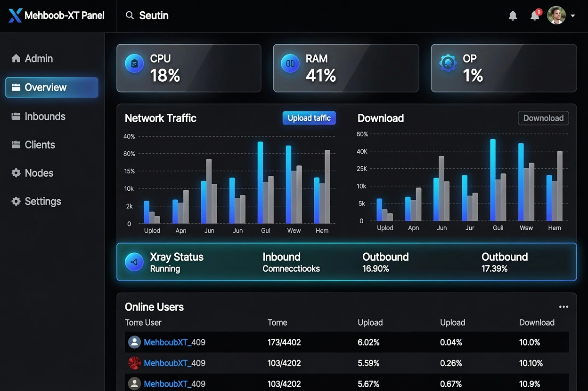
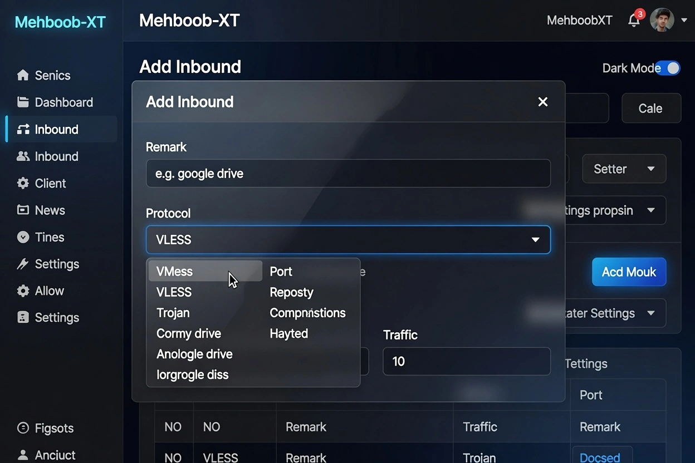
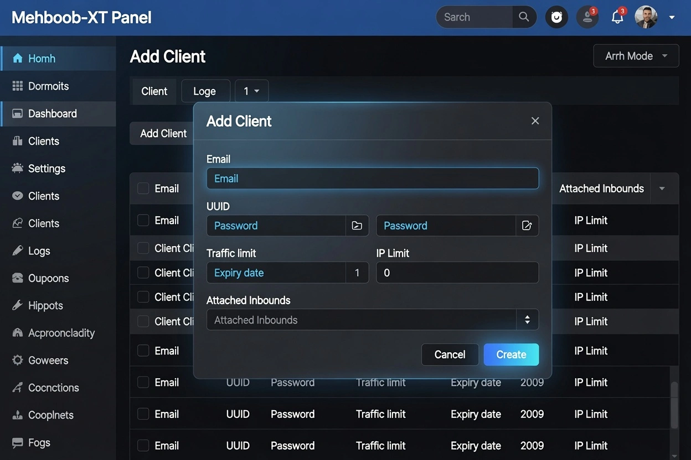
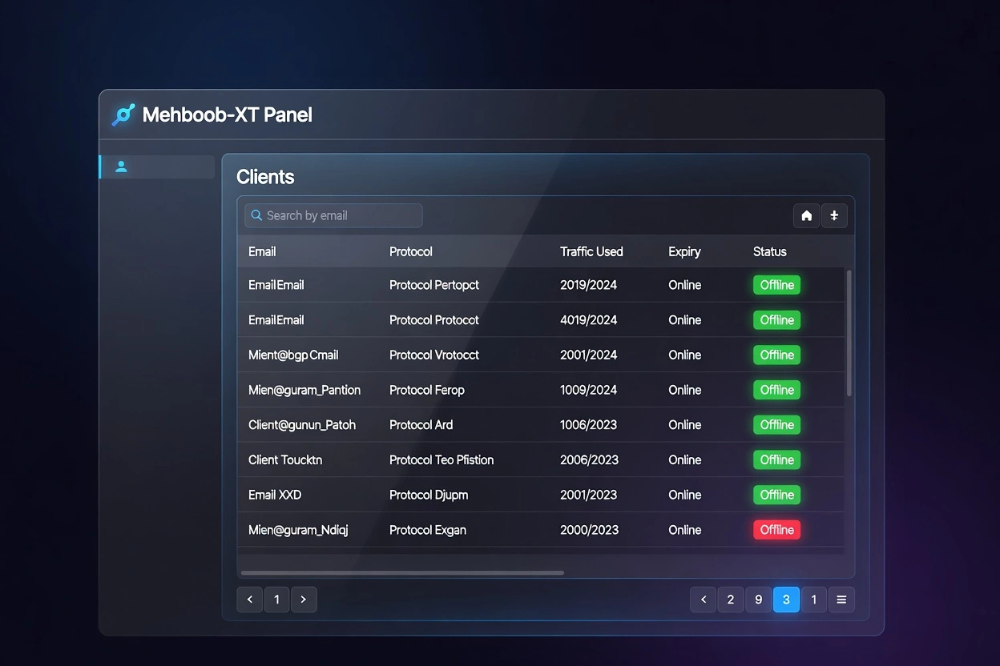

<div align="center">
  
  

  <h1>Mehboob-XT Panel</h1>
  <p><strong>Premium • Powerful • Modern Xray Control Panel</strong></p>

  <p>
    
    
    
    
    
  </p>

  <p>
    <a href="#-english">English</a> •
    <a href="#-اردو">اردو</a> •
    <a href="#-فارسی">فارسی</a> •
    <a href="#-中文">中文</a>
  </p>

</div>

<br>

**Mehboob-XT** is a highly enhanced, premium-grade web control panel for managing Xray-core servers.  
Built for performance, beauty, and power — it delivers a clean modern interface with advanced features that go beyond standard panels.

Perfect for personal use, multi-node setups, and high-demand environments.

> **Important**  
> This project is intended for **personal use only**.  
> Please do not use it for illegal purposes or in a production environment.

---

## Features

### Core Capabilities
- **Multi-Protocol Inbounds** — VLESS, VMess, Trojan, Shadowsocks, WireGuard, Hysteria2, SSH, HTTP, SOCKS (Mixed) & more
- **Modern Transports & Security** — TCP, WebSocket, gRPC, HTTPUpgrade, XHTTP with TLS, XTLS & REALITY
- **Fallbacks** — Serve multiple protocols on a single port (e.g. VLESS + Trojan on 443)
- **Per-Client Management** — Traffic quotas, expiry dates, IP limits, live online status, one-click share links, QR codes & subscriptions

### Advanced Control
- **Traffic Statistics** — Per inbound, per client, and per outbound with reset controls
- **Multi-Node Support** — Manage and scale across multiple servers from a single panel
- **Outbound & Routing** — WARP, custom routing rules, load balancers & outbound proxy chaining
- **Built-in Subscription Server** — Multiple output formats + custom page templates
- **Telegram Bot** — Remote monitoring and management
- **RESTful API** — Fully documented
- **Flexible Storage** — SQLite (default) or PostgreSQL
- **Auto SSL** — Let's Encrypt support
- **Fail2Ban Integration** — Enforce per-client IP limits

### Premium Tools (Coming Soon)
- Advanced Config Generator (HTTP Custom + Dark Tunnel + FreeBasics)
- Reseller System with Balance & Permissions
- Custom Branding
- Multi-Admin Roles

---

## Screenshots

| Dashboard Overview | Add Inbound |
|:---:|:---:|
|  |  |

| Add Client | Clients List |
|:---:|:---:|
|  |  |

---

## Quick Start

```bash
bash <(curl -Ls https://raw.githubusercontent.com/mehboob-xt/mehboobxt-panel/main/install.sh)
